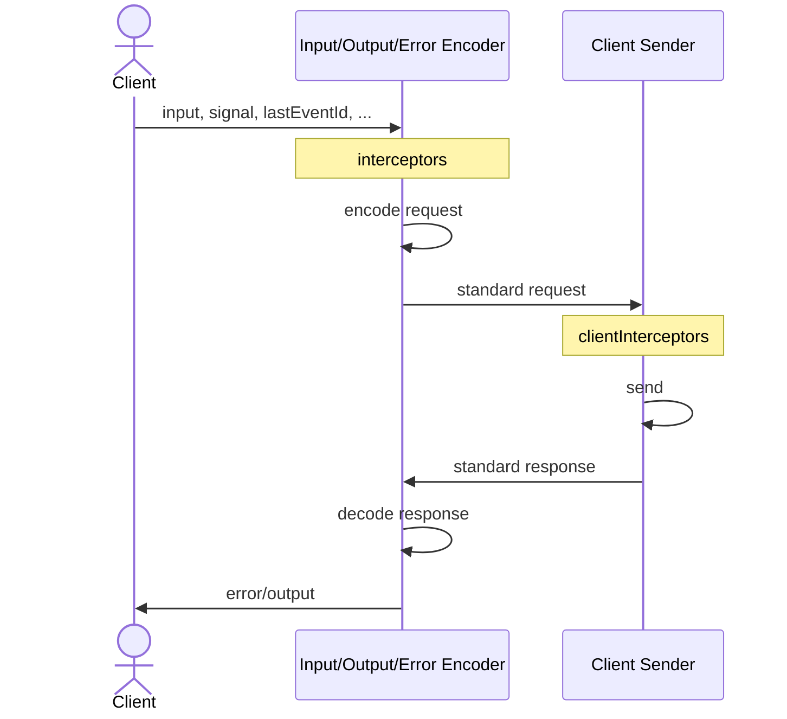

# RPCLink

RPCLink enables communication with an [RPCHandler](/docs/rpc-handler) or any API that follows the [RPC Protocol](/docs/advanced/rpc-protocol) using HTTP/Fetch.

:::warning
This documentation is focused on the [HTTP Adapter](/docs/adapters/http).
Other adapters may remove or change options to keep things simple.
:::

## Overview

Before using RPCLink, make sure your server is set up with [RPCHandler](/docs/rpc-handler) or any API that follows the [RPC Protocol](/docs/advanced/rpc-protocol).

```ts
import { onError } from '@orpc/client'
import { RPCLink } from '@orpc/client/fetch'

const link = new RPCLink({
  url: 'http://localhost:3000/rpc',
  headers: () => ({
    'x-api-key': 'my-api-key'
  }),
  fetch: (request, init) => {
    return globalThis.fetch(request, {
      ...init,
      credentials: 'include', // Include cookies for cross-origin requests
    })
  },
  interceptors: [
    onError((error) => {
      console.error(error)
    })
  ],
})

export const client: RouterClient<typeof router> = createORPCClient(link)
```

## Using Client Context

Client context lets you pass extra information when calling procedures and dynamically modify RPCLink’s behavior.

```ts twoslash
import { router } from './shared/planet'
import { RouterClient } from '@orpc/server'
import { createORPCClient } from '@orpc/client'
import { RPCLink } from '@orpc/client/fetch'

interface ClientContext {
  something?: string
}

const link = new RPCLink<ClientContext>({
  url: 'http://localhost:3000/rpc',
  headers: async ({ context }) => ({
    'x-api-key': context?.something ?? ''
  })
})

const client: RouterClient<typeof router, ClientContext> = createORPCClient(link)

const result = await client.planet.list(
  { limit: 10 },
  { context: { something: 'value' } }
)
```

:::info
If a property in `ClientContext` is required, oRPC enforces its inclusion when calling procedures.
:::

## Custom Request Method

By default, RPCLink sends requests via `POST`. You can override this to use methods like `GET` (for browser or CDN caching) based on your requirements.

::: warning
By default, [RPCHandler](/docs/rpc-handler) in the [HTTP Adapter](/docs/adapters/http) enabled [StrictGetMethodPlugin](/docs/rpc-handler#default-plugins) which blocks GET requests except for procedures explicitly allowed. Please refer to [StrictGetMethodPlugin](/docs/plugins/strict-get-method) for more details.
:::

```ts twoslash
import { RPCLink } from '@orpc/client/fetch'

interface ClientContext {
  cache?: RequestCache
}

const link = new RPCLink<ClientContext>({
  url: 'http://localhost:3000/rpc',
  method: ({ context }, path) => {
    // Use GET for cached responses
    if (context?.cache) {
      return 'GET'
    }

    // Use GET for rendering requests
    if (typeof window === 'undefined') {
      return 'GET'
    }

    // Use GET for read-like operations
    if (path.at(-1)?.match(/^(?:get|find|list|search)(?:[A-Z].*)?$/)) {
      return 'GET'
    }

    return 'POST'
  },
  fetch: (request, init, { context }) => globalThis.fetch(request, {
    ...init,
    cache: context?.cache,
  }),
})
```

::: details Automatically use method specified in contract?

By using `inferRPCMethodFromContractRouter`, the `RPCLink` automatically uses the method specified in the contract when sending requests.

```ts
import { inferRPCMethodFromContractRouter } from '@orpc/contract'

const link = new RPCLink({
  url: 'http://localhost:3000/rpc',
  method: inferRPCMethodFromContractRouter(contract),
})
```

::: info
A normal [router](/docs/router) works as a contract router as long as it does not include a [lazy router](/docs/router#lazy-router). For more advanced use cases, refer to the [Router to Contract](/docs/contract-first/router-to-contract) guide.
:::

## Lazy URL

You can define `url` as a function, ensuring compatibility with environments that may lack certain runtime APIs.

```ts
const link = new RPCLink({
  url: () => {
    if (typeof window === 'undefined') {
      throw new Error('RPCLink is not allowed on the server side.')
    }

    return `${window.location.origin}/rpc`
  },
})
```

## SSE Like Behavior

Unlike traditional SSE, the [Event Iterator](/docs/event-iterator) does not automatically retry on error. To enable automatic retries, refer to the [Client Retry Plugin](/docs/plugins/client-retry).

## Event Iterator Keep Alive

:::warning
These options for sending [Event Iterator](/docs/event-iterator) from **client to the server**, not from **the server to client** as used in [RPCHandler Event Iterator Keep Alive](/docs/rpc-handler#event-iterator-keep-alive) or [OpenAPIHandler Event Iterator Keep Alive](/docs/openapi/openapi-handler#event-iterator-keep-alive).

**In 99% of cases, you don't need to configure these options.**
:::

To keep [Event Iterator](/docs/event-iterator) connections alive, `RPCLink` periodically sends a ping comment to the server. You can configure this behavior using the following options:

- `eventIteratorKeepAliveEnabled` (default: `true`) – Enables or disables pings.
- `eventIteratorKeepAliveInterval` (default: `5000`) – Time between pings (in milliseconds).
- `eventIteratorKeepAliveComment` (default: `''`) – Custom content for ping messages.

```ts
const link = new RPCLink({
  eventIteratorKeepAliveEnabled: true,
  eventIteratorKeepAliveInterval: 5000, // 5 seconds
  eventIteratorKeepAliveComment: '',
})
```

## Lifecycle



::: tip
Interceptors can be used to intercept and modify the lifecycle at various stages.
:::
