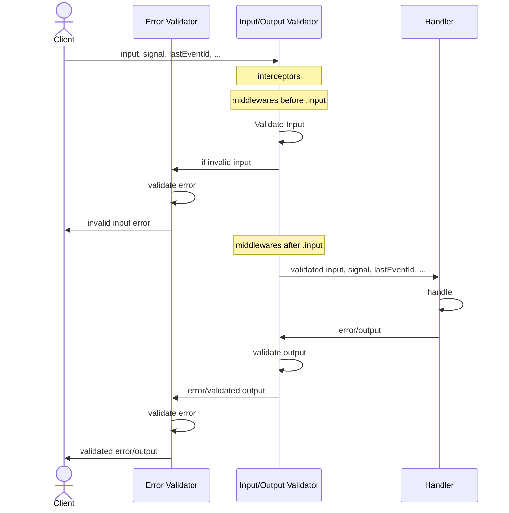

# Server-Side Clients

Call your [procedures](/docs/procedure) in the same environment as your server—no proxies required like native functions.

## Calling Procedures

oRPC offers multiple methods to invoke a [procedure](/docs/procedure).

### Using `.callable`

Define your procedure and turn it into a callable procedure:

```ts twoslash
import { os } from '@orpc/server'
import * as z from 'zod'

const getProcedure = os
  .input(z.object({ id: z.string() }))
  .handler(async ({ input }) => ({ id: input.id }))
  .callable({
    context: {} // Provide initial context if needed
  })

const result = await getProcedure({ id: '123' })
```

### Using the `call` Utility

Alternatively, call your procedure using the `call` helper:

```ts twoslash
import * as z from 'zod'
import { call, os } from '@orpc/server'

const getProcedure = os
  .input(z.object({ id: z.string() }))
  .handler(async ({ input }) => ({ id: input.id }))

const result = await call(getProcedure, { id: '123' }, {
  context: {} // Provide initial context if needed
})
```

## Router Client

Create a [router](/docs/router) based client to access multiple procedures:

```ts twoslash
import * as z from 'zod'
// ---cut---
import { createRouterClient, os } from '@orpc/server'

const ping = os.handler(() => 'pong')
const pong = os.handler(() => 'ping')

const client = createRouterClient({ ping, pong }, {
  context: {} // Provide initial context if needed
})

const result = await client.ping()
```

### Client Context

You can define a client context to pass additional information when calling procedures. This is useful for modifying procedure behavior dynamically.

```ts twoslash
import * as z from 'zod'
import { createRouterClient, os } from '@orpc/server'
// ---cut---
interface ClientContext {
  cache?: boolean
}

const ping = os.handler(() => 'pong')
const pong = os.handler(() => 'ping')

const client = createRouterClient({ ping, pong }, {
  context: ({ cache }: ClientContext) => { // [!code highlight]
    if (cache) {
      return {} // <-- context when cache enabled
    }

    return {} // <-- context when cache disabled
  }
})

const result = await client.ping(undefined, { context: { cache: true } })
```

:::info
If `ClientContext` contains a required property, oRPC enforces that the client provides it when calling a procedure.
:::

## Lifecycle



### Middlewares Order

To ensure that all middlewares run after input validation and before output validation, apply the following configuration:

```ts
const base = os.$config({
  initialInputValidationIndex: Number.NEGATIVE_INFINITY,
  initialOutputValidationIndex: Number.NEGATIVE_INFINITY,
})
```

:::info
By default, oRPC executes middlewares based on their registration order relative to validation steps. Middlewares registered before `.input` run before input validation, and those registered after `.output` run before output validation.
:::
