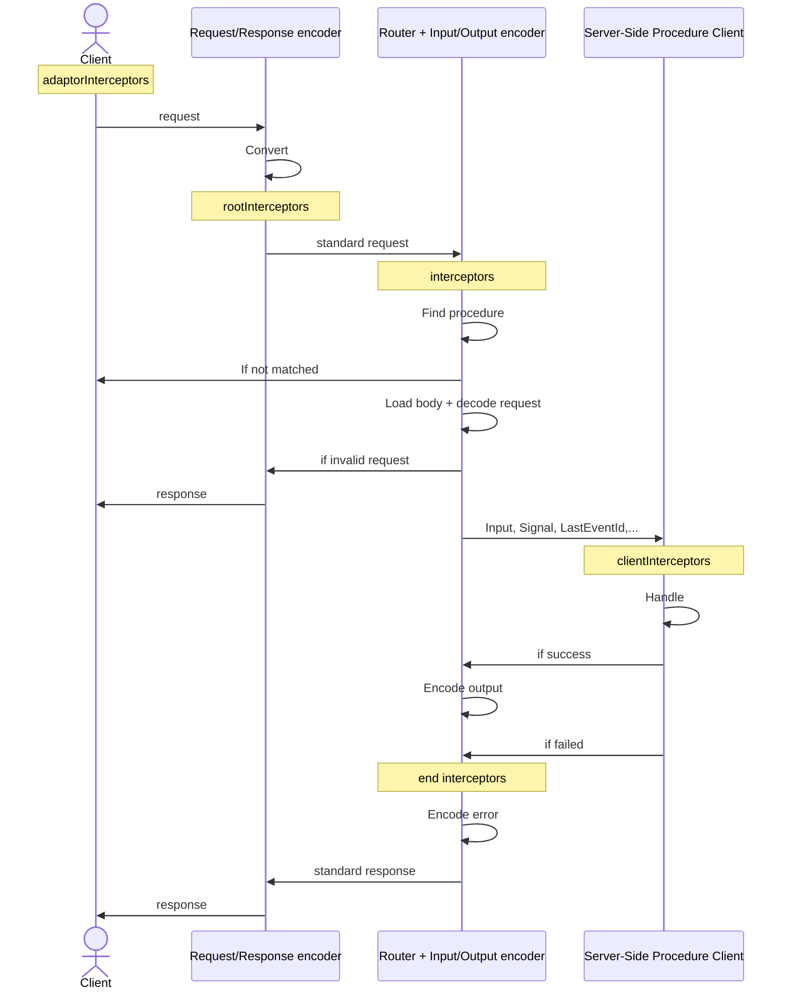

# RPC Handler

The `RPCHandler` enables communication with clients over oRPC's proprietary [RPC protocol](/docs/advanced/rpc-protocol), built on top of HTTP. While it efficiently transfers native types, the protocol is neither human-readable nor OpenAPI-compatible. For OpenAPI support, use the [OpenAPIHandler](/docs/openapi/openapi-handler).

:::warning
`RPCHandler` is designed exclusively for [RPCLink](/docs/client/rpc-link) and **does not** support OpenAPI. Avoid sending requests to it manually.
:::

:::warning
This documentation is focused on the [HTTP Adapter](/docs/adapters/http).
Other adapters may remove or change options to keep things simple.
:::

## Supported Data Types

`RPCHandler` natively serializes and deserializes the following JavaScript types:

- **string**
- **number** (including `NaN`)
- **boolean**
- **null**
- **undefined**
- **Date** (including `Invalid Date`)
- **BigInt**
- **RegExp**
- **URL**
- **Record (object)**
- **Array**
- **Set**
- **Map**
- **Blob** (unsupported in `AsyncIteratorObject`)
- **File** (unsupported in `AsyncIteratorObject`)
- **AsyncIteratorObject** (only at the root level; powers the [Event Iterator](/docs/event-iterator))

:::tip
You can extend the list of supported types by [creating a custom serializer](/docs/advanced/rpc-json-serializer#extending-native-data-types).
:::

## Setup and Integration

```ts
import { RPCHandler } from '@orpc/server/fetch' // or '@orpc/server/node'
import { CORSPlugin } from '@orpc/server/plugins'
import { onError } from '@orpc/server'

const handler = new RPCHandler(router, {
  plugins: [
    new CORSPlugin()
  ],
  interceptors: [
    onError((error) => {
      console.error(error)
    })
  ],
})

export default async function fetch(request: Request) {
  const { matched, response } = await handler.handle(request, {
    prefix: '/rpc',
    context: {} // Provide initial context if required
  })

  if (matched) {
    return response
  }

  return new Response('Not Found', { status: 404 })
}
```

## Filtering Procedures

You can filter a procedure from matching by using the `filter` option:

```ts
const handler = new RPCHandler(router, {
  filter: ({ contract, path }) => !contract['~orpc'].route.tags?.includes('internal'),
})
```

## Event Iterator Keep Alive

To keep [Event Iterator](/docs/event-iterator) connections alive, `RPCHandler` periodically sends a ping comment to the client. You can configure this behavior using the following options:

- `eventIteratorKeepAliveEnabled` (default: `true`) – Enables or disables pings.
- `eventIteratorKeepAliveInterval` (default: `5000`) – Time between pings (in milliseconds).
- `eventIteratorKeepAliveComment` (default: `''`) – Custom content for ping comments.

```ts
const handler = new RPCHandler(router, {
  eventIteratorKeepAliveEnabled: true,
  eventIteratorKeepAliveInterval: 5000, // 5 seconds
  eventIteratorKeepAliveComment: '',
})
```

## Default Plugins

`RPCHandler` automatically enables **essential plugins** for security reasons.

| Plugin                                                   | Applies To                          | Toggle Option                  |
| -------------------------------------------------------- | ----------------------------------- | ------------------------------ |
| [StrictGetMethodPlugin](/docs/plugins/strict-get-method) | [HTTP Adapter](/docs/adapters/http) | `strictGetMethodPluginEnabled` |

::: info
You can safely disable default plugins if they don't provide any meaningful benefit for your use case.
:::

## Lifecycle



::: tip
Interceptors can be used to intercept and modify the lifecycle at various stages.
:::

:::info

- The Server-side Procedure Client is a [Server-Side Client](/docs/client/server-side), and `clientInterceptors` are the same as [Server-Side Client Interceptors](/docs/client/server-side#lifecycle).
- Some `RPCHandler` implementations may omit the `Request/Response encoder` when it's not required.

:::
